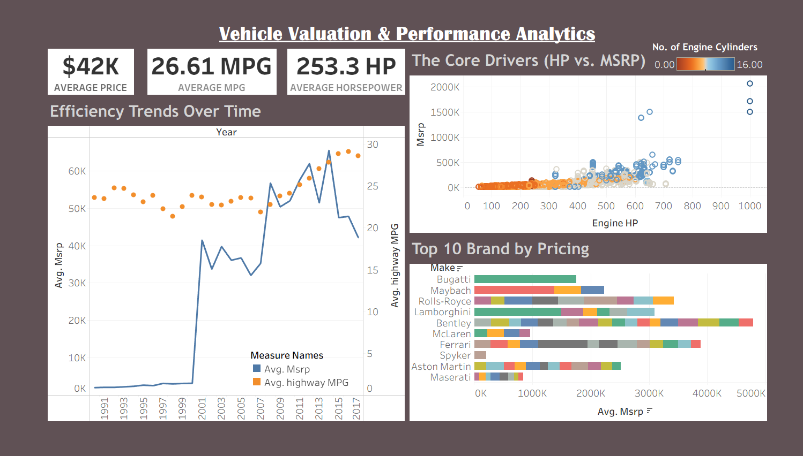

# 🚗 Vehicle Valuation Performance Analytics

## 📊 Project Overview

This project focuses on analyzing vehicle valuation and pricing trends using interactive visual analytics in Tableau and data processing in Python.

The objective is to identify key factors affecting vehicle valuation and transform raw data into actionable business insights.

---

## 🎯 Objective

- Analyze vehicle valuation trends
- Identify factors influencing vehicle prices
- Build interactive dashboard visualizations
- Support data-driven business decisions

---

## ⚙️ Project Workflow

### 🔹 Data Processing (Python)
- Data Cleaning
- Missing Value Handling
- Feature Analysis
- Exploratory Data Analysis (EDA)

### 🔹 Visualization (Tableau)
- KPI Dashboard
- Interactive Filters
- Comparative Analysis
- Trend Visualization

---

## 📈 Dashboard Features

✔ Interactive Tableau Dashboard  
✔ Dynamic filtering and drill-down analysis  
✔ Vehicle valuation comparison  
✔ Business-focused visual storytelling  
✔ Analytical insights for pricing trends  

---

## 📷 Dashboard Preview



---

## 🎥 Live Dashboard Demo

[▶️ View Tableau Dashboard](https://public.tableau.com/views/VehicleValuationperformanceAnalytics/Dashboard1?:language=en-US&publish=yes&:sid=&:redirect=auth&:display_count=n&:origin=viz_share_link)

---

## 🛠 Tech Stack

### 📌 Tools & Technologies
- Python
- Pandas
- NumPy
- Matplotlib / Seaborn
- Tableau

---

## 💡 Business Impact

- Helps understand vehicle pricing behavior
- Supports valuation and pricing strategies
- Enables insight-driven decision-making
- Demonstrates real-world analytical workflow

---

## 📂 Repository Structure

```bash
📁 Vehicle-Valuation-Analytics/
│── Car_Price_Analysis.ipynb
│── vehicle_dashboard.png
│── README.md
```

## ⭐ Support

If you found this project useful:
⭐ Star the repository
🔗 Feel free to connect and share feedback!

## 🔖 Tags

`Tableau` `Python` `DataAnalytics` `Dashboard` `BusinessIntelligence`
